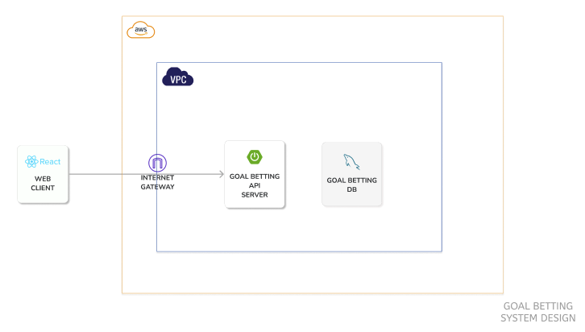
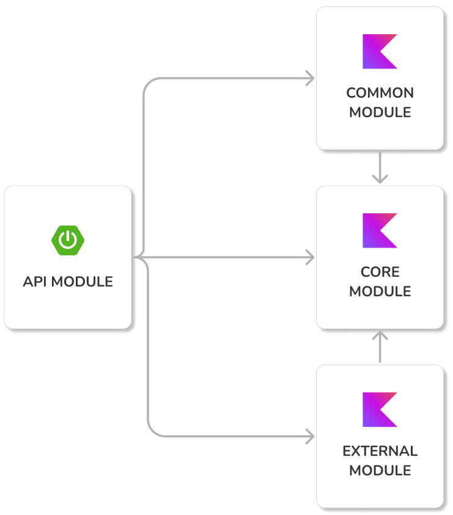

## 미르었던 다짐

2024년 새해를 맞아 미루었던 다짐을 생성하고 다짐을 이루는데 도움을 주고자 하는 서비스입니다.

설정한 다짐을 이뤄냈다면 기프티콘은 돌려받지만, 실패하면 내 다짐에 응원을 남긴 지인들에게 랜덤으로 돌려주는 서비스입니다.

---

## 인프라 구조

---

## 모듈 구조

---

## R&R

<table>
    <td align="center"><a href="https://github.com/mkSpace"> <b>박재민</b></a> 💻</a></td>
    <td align="center"><a href="https://github.com/K-Diger"> <b>김도현</b></a> 💻</a></td>
  </tr>
</table>
